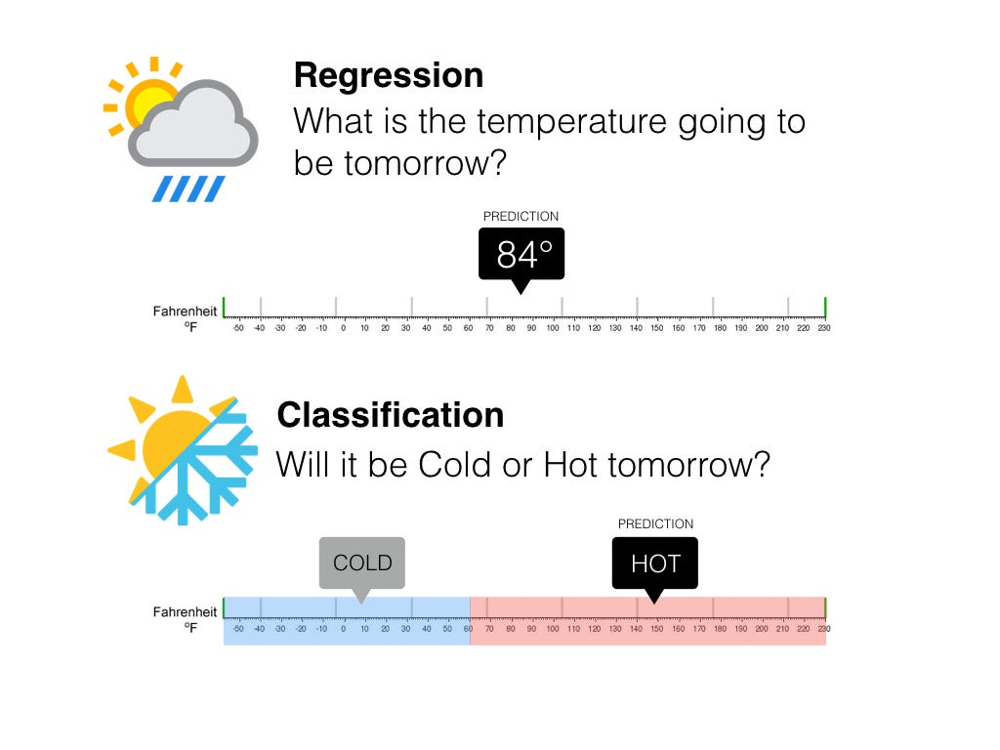
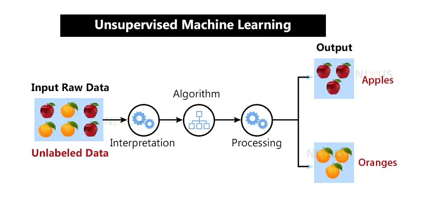
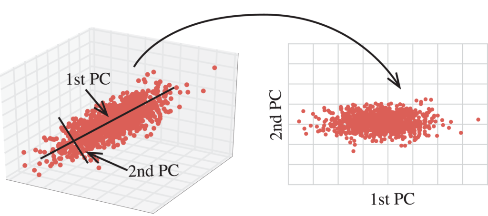
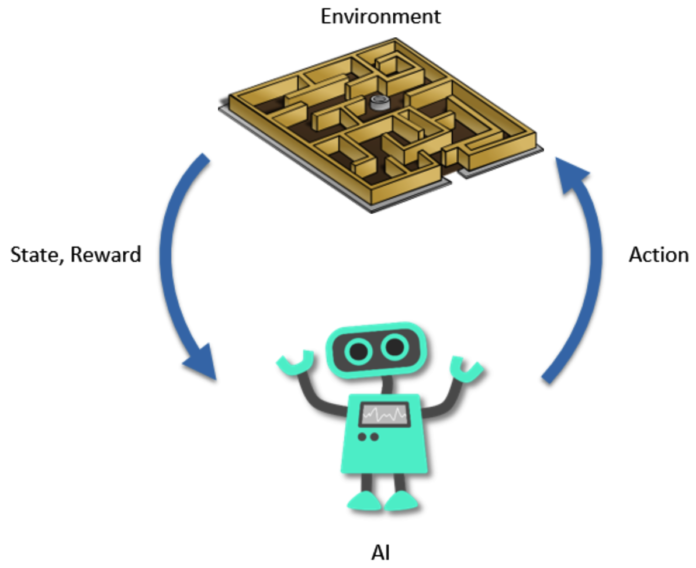

***=> MACHINE LEARNING***
    
    Os algoritmos de Machine Learning podem ser dividos de acordo com a forma como o aprendizado funciona!

**=> APREDIZAGEM SUPERVISIONADA**

    Supervised Learning ou aprendizagem supervisionada, é uma categoria de algoritmos de Machine Learning. Chamamos esses algoritmos de supervisionados porque usamos um conjunto de dados que possuem resultados já observados, ou já rotulados, que serão usados para treinar os algoritmos para classificar ou prever resultados com um certo grau de acerto.

=> DIFERENÇA ENTRE REGRESSÃO E CLASSIFICAÇÃO

    Na Regressão, o algoritmo tem por objetivo prever um valor contínuo (real), usando dados de input, se baseando em dados históricos (de treino).

    Na Classificação, o algoritmo tem por objetivo prever uma categoria, usando dados de input, se baseando em dados de treino.

=> APLICAÇÃO DE ALGORITMOS DE REGRESSÃO

    Em qualquer situação que quisermos prever um valor numérico baseado em dados históricos, podemos usar um algoritmo de Regressão. Vejamos algumas aplicações:

    * Previsão de demanda de certo produto
    * Previsão de do PIB de um país
    * Previsão da audiência em um site na Black Friday
    * Previsão de preços de barril de petróleo
    * Previsão do quanto uma pessoa vai gastar em produtos em um e-commerce

=>APLICAÇÃO DE ALGORITMOS DE CLASSIFICAÇÃO

    Toda vez que for necessário classificar um conjunto de dados em categorias já pré-estabelecidas, podemos usar um algoritmo de Classificação. Vejamos algumas aplicações:

    * Detecção de Spam em email
    * Classificação de Imagem
    * Identificação de doenças em exames
    * Identificação Biométrica
    * Análise de sentimento em imagens ou textos
    * Previsão de Churn em clientes 
    * Detecção de Anomalia - detecção de fraude

**=>APREDIZADO NÃO SUPERVISIONADO**

    Unsupervised Learning ou aprendizado não supervisionado, é uma categoria de algoritmos de Machine Learning. Chamamos esses algoritmos de não supervisionados porque, nesse caso, o conjunto de dados não possui resultados já observados, ou já rotulados, que seriam usados para treinar os algoritmos. Essa classe de algoritmos usa os dados disponíveis para achar padrões e informações que não foram possíveis de forma manual.

=> REDUÇÃO DE DIMENSIONALIDADE

    Redução de dimensionalidade é uma técnica utilizada para diminuir o número de variáveis em um conjunto de dados. Quando utilizamos muitas variáveis como input para treinar um algoritmo de machine learning, é provável que o algoritmo não tenha um bom desempenho quando lidar com novos dados ainda não observáveis, pois se ajusta demais aos dados utilizados para treiná-lo. Chamamos de alta dimensionalidade um conjunto com muitas variáveis, onde muito pode significar centenas, milhares ou até mesmo milhões de variáveis diferentes.

=> CLUSTERIZAÇÃO

    Algoritmos de clusterização são modelos de machine learning utilizados para identificar grupos de dados com características em comum, quando não temos as informações dos grupos já pré-definidas. Esses grupos são chamados de clusters, e essa técnica é muito usado como uma forma de descobrir padrões nos dados, como grupos de clientes parecidos com base em seu comportamento.

=>APLICAÇÃO DE ALGORITMOS DE CLUSTERIZAÇÃO

    Vejamos algumas aplicações de algoritmos de clusterização:

    * Segmentação de usuários de acordo com seu comportamento
    * Detecção de fraude em seguros
    * Recomendação de conteúdo
    * Análise exploratória de dados pouco conhecidos

**APRENDIZADO POR REFORÇO**

    Reinforcement Learning ou aprendizado por reforço, é uma categoria de algoritmos de Machine Learning. Os algoritmos de reinforcement learning funcionam baseados em recompensa e punição. Através de tentativa e erro, o algoritmo é recompensado quando acerta e punido quando erra. Assim, ao longo do tempo, ele aprende o que dá recompensa e tende a acertar mais do que errar.

=>QUAL A DIFERENÇA ENTRE OS TRES TIPOS DE APREDIZAGEM?

=> APLICAÇÕES DE ALGORITMOS DE REFORÇO

    Existem vários algoritmos diferentes de aprendizado por reforço, e suas aplicações também são diversas:

    * Games
    * Recomendação de conteúdo
    * Carros autônomos
    * Gerenciamento de recursos em redes de computadores