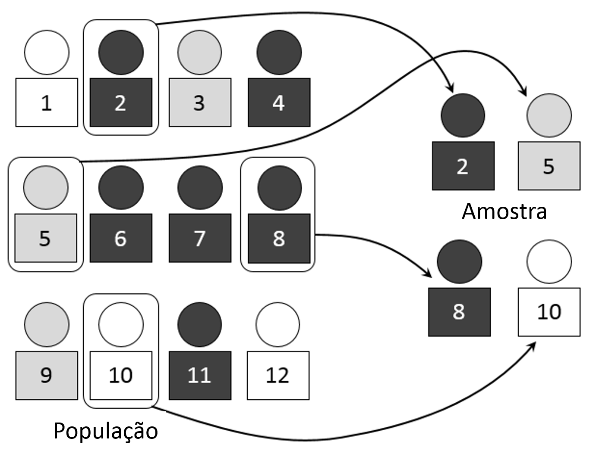
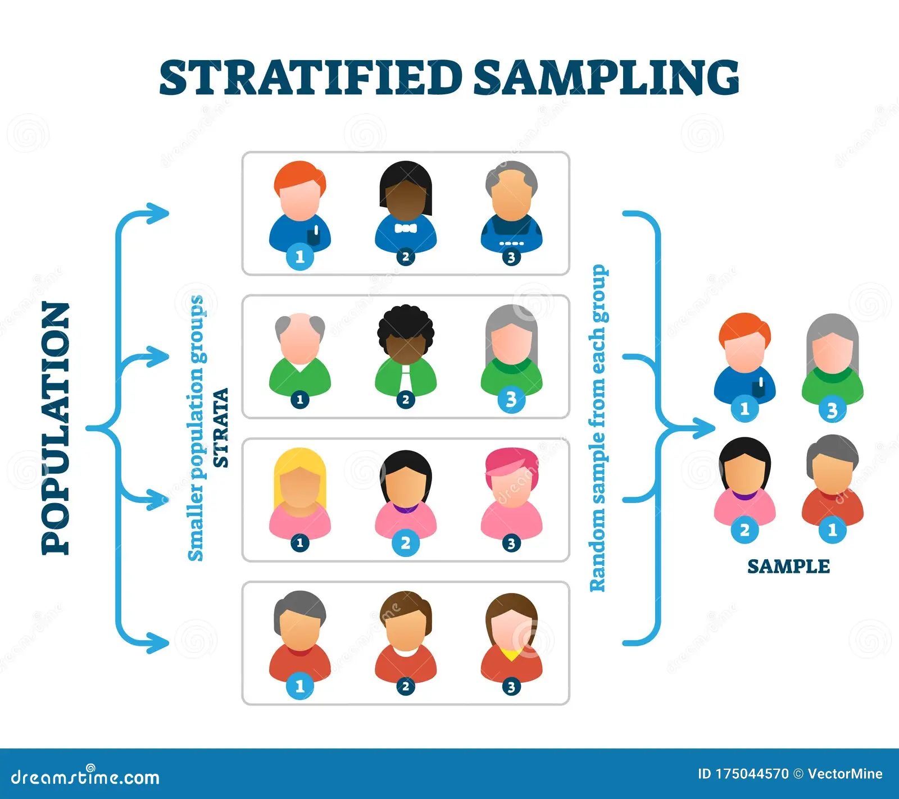
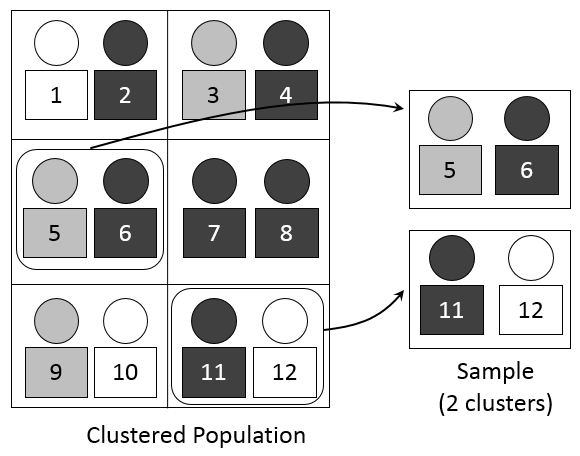

=> AMOSTRAGEM ALEATÓRIA SIMPLES

    Método de amostragem aleatória simples.

    Essa é a forma mais simples de se amostrar em termos de código. O Python tem seu método bult-in para cálculo de amostras aleatórias, assim como a biblioteca pandas, bastante utilizada para análise exploratória de dados.

=>AMOSTRAGEM SISTEMATICA

    Método de amostragem sistemática.

    Vamos usar o exemplo acima, onde pegamos a terceira ocorrência, começando da segunda observação.

=>AMOSTRAGEM ESTRATIFICADA

     Método de amostragem estratificada.

    Nessa amostragem, vamos olhar para cada estrato para retirar amostras para então formar nossa amostra final

=>AMOSTRAGEM POR COMGLOMERADO

    método de amostragem por conglomerado.

    Aqui, precisaremos primeiro amostrar aleatóriamente os conglomerados para então pegar todas as observações desses conglomerados escolhidos e formar nossa amostra.