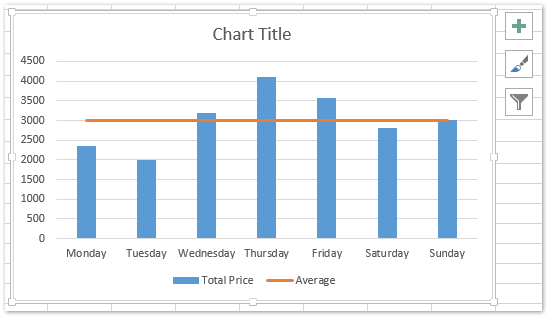
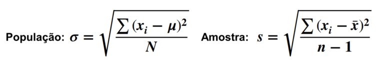
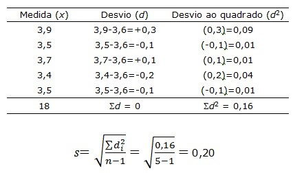
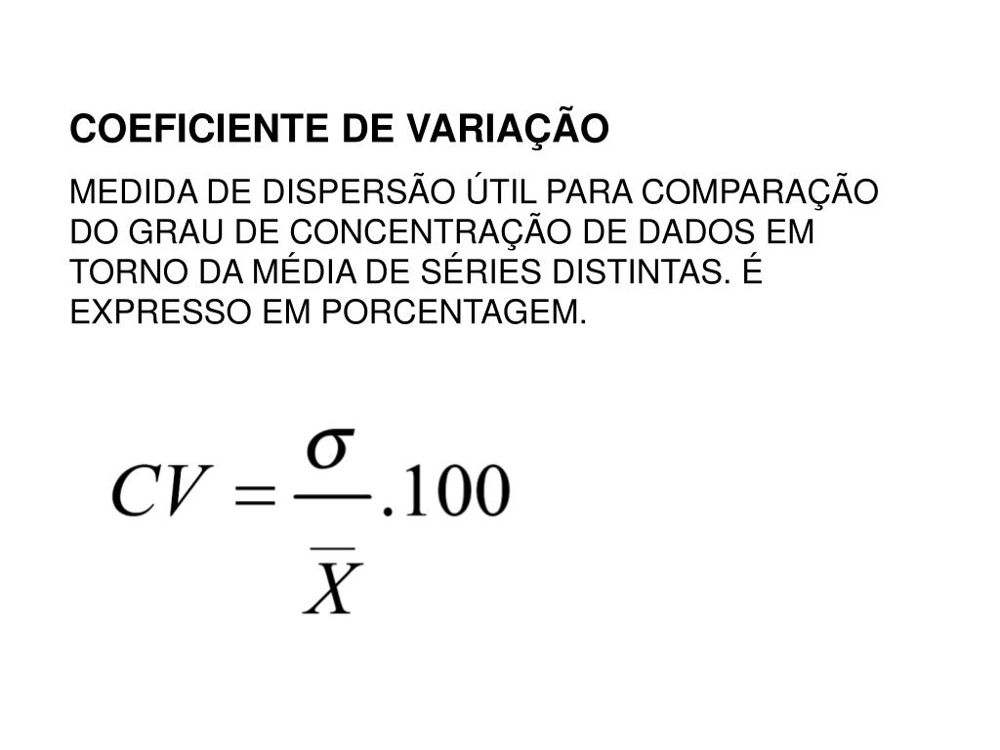
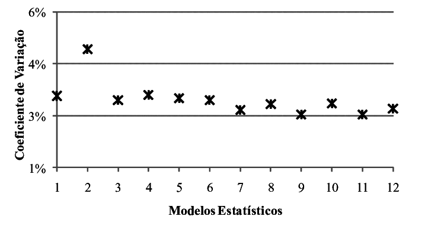
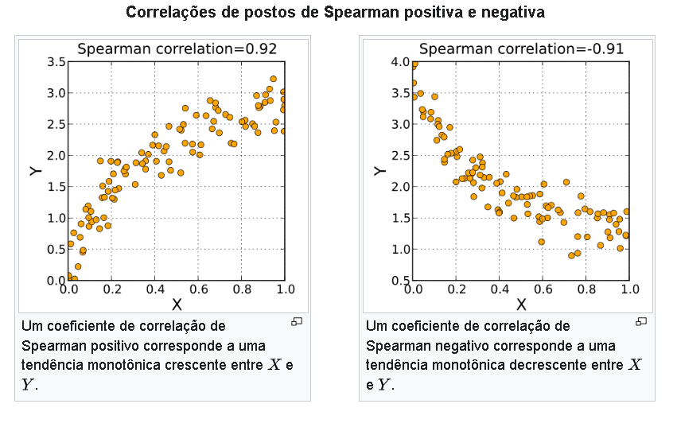

=>TENDÊCIA CENTRAL

    É uma medida de valores numa amostra que identifica os diferentes pontos centrais nos dados.

    As medidas mais comuns de tendência central são a média, a mediana e a moda.

=>MODA

    É uma medida estatística de tendência central, que interessa sempre que estivermos em busca dos valores mais comuns de um dado, ou seja, o valor que mais se repete dentro de uma série de observações.

=>MÉDIA

    Calculamos a média simplesmente somando todos os valores e dividindo pelo tamanho da amostra.

    A média é uma importante medida que busca expressar a tendência central dos dados de interesse.

Apesar de ser muito popular e fácil de ser calculada, precisamos tomar cuidados especiais com a média. Isso porque ela é facilmente influenciada por valores extremos na nossa amostra!

=> MEDIANA

    A mediana é uma medida de tendência central muito interessante. Ela faz uma divisão exatamente no meio dos nossos dados. É o valor do meio do nosso conjunto de dados.

    Para que a mediana seja calculada, primeiramente precisamos ordenar os dados para que então seja identificado o valor do meio. Por isso, a mediana é relativamente custosa de ser calculada, principalmente em cenários de big data.

    Ao contrário da média, a mediana não é facilmente influenciada por valores extremos!

 

=>MEDIDAS DE DISPERSÃO

    Medidas de dispersão são medidas estatísticos utilizadas para identificar o grau de variabilidade de um conjunto de dados. As medidas de dispersão mais comuns são a variância, desvio padrão e coeficiente de variação.

=>VARIANÇA

    A variância é uma medida de dispersão que nos ajuda a entender o quão longe da média os dados estão.Na prática, a variância é a média do quadrado das distâncias entre cada observação e a média.

 

    Por que precisamos elevar ao quadrado??

    Queremos medir a distância entre cada observação e a média, mas pode ser que alguma observação seja menor do que a média! Nesse caso, somente fazer a diferença entre a observação e a média daria um valor negativo, e acabaria se anulando com as outras distâncias.

=>DESVIO PADRÃO

    No cálculo da variância, elevamos as diferenças ao quadrado para que as distaâncias sejam positivas. Entretanto, ao fazer isso, a variância acaba ficando numa escala diferente dos dados, porque está em uma escala quadrática. Por isso, utilizamos o desvio padrão, que nada mais é do que a raiz quadrada da variância.

 

 
   
   Vamos ver um exemplo do cálculo do desvio padrão

 

    Como o desvio padrão é a raiz quadrada da variância, ele também vai, assim como a média, ser facilmente influenciada por valores extremos

=>COEFICIENTE DE VARIAÇÃO

    Com o desvio padrão, temos uma medida de dispersão na mesma escala dos nossos dados. Entretanto, como saber se os dados são muito variados ou pouco? Como saber se o nosso desvio padrão é pequeno ou grande? Para isso, temos o Coeficiente de Variação!

 

    O coeficiente de variação é o quociente entre o desvio padrão e a média e, já que multiplicamos por 100, ele vira uma porcentagem. Quanto maior essa porcentagem, podemos dizer que mais distantes da média os dados estão e, consequentemente, mais variados os dados estão.

=>QUANTIS E QUARTIS
    Nos ajudam a entender o que ocorre em certa porcentagem dos nossos dados. Eles recortam nossos dados na quantidade que pedimos, e então temos uma noção melhor de como as observações estão se comportando.

    O percentil 10% (quantil 0.10), por exemplo, nos informa qual é o valor máximo dos dados se eu considerar somente os 10% primeiros termos dos meus dados, depois de ordená-los.
Os quartis são quantis específicos:
* 1˚ Quartil = Quantil 0.25
* 2˚ Quartil = Mediana = Quantil 0.50
* 3˚ Quartil = Quantil 0.75

    Os quantis são de muita importância quando queremos entender melhor a própria dispersão dos dados que estamos analisando. Alguns exemplos dentre as várias aplicações para eles:
* Identificar comportamentos muito diferentes do restante dos dados (Outliers)
* Entender em qual corte a maioria dos dados se encontram, ou até mesmo uma parte específica deles
* Ajudar na tomada de decisão em situações de Trade-Off. Ex: Acurácia de Localização
* Boxplot

=> CORRELAÇÃO
    
    A correlação é uma medida que tenta identificar o grau de relacionamento entre duas variáveis. Ela é muito útil para entender se uma variável exerce influência em outra. Por exemplo, a altura é correlacionada com a idade de uma criança?

   
    A correlação varia entre -1 e 1: se assumir o valor -1, as variáveis são totalmente correlacionadas uma com a outra, sendo que enquanto uma cresce, a outra diminui. Quando a correlação assume valor 1, vice e versa. Quando for 0, indica que as variáveis não são relacionadas.

   
    Existem várias formas de se calcular a correlação entre duas variáveis. Podemos dividi-las em 2 tipos de correlação, as lineares e as não lineares.

* Correlação de Pearson

    O Coeficiente de Correlação de Pearson é também conhecido como Coeficiente de Correlação Linear, se trata de uma técnica para medir se duas variáveis estão relacionadas de maneira linear. Essa é a correlação mais conhecida e mais utilizada.

 

    O sinal (-/+) informa qual a direção da reta (decrescente ou crescente).
    O valor informa o grau/força de relacionamento.

 

=>CORRELAÇÃO DE SPEARMAN

    A correlação de Spearman, de maneira simplificada, analisa se quando o valor de uma variável aumenta ou diminui, o valor da outra variável aumenta ou diminui.

    Uma vez que a correlação de Spearman segue essa lógica e não tem pressupostos lineares como na correlação de Pearson, é possível utilizá-la para relações não lineares.

    Em geral, usamos a correlação de Spearman quando:
* a relação entre as variáveis pode ser não linear
* uma das variáveis é um ranking
* quando existem muitos valores extremos nos dados, causando uma variância muito grande   