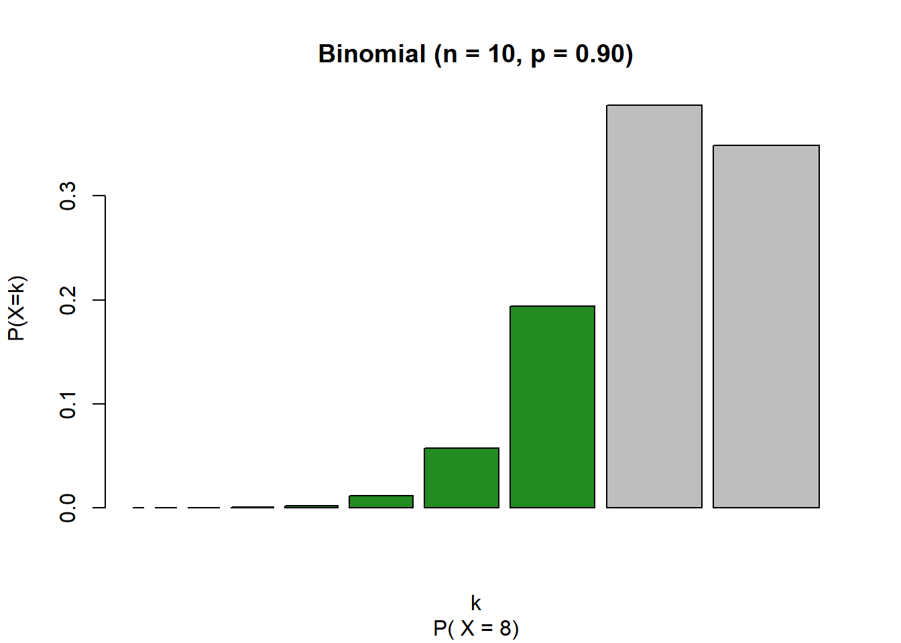
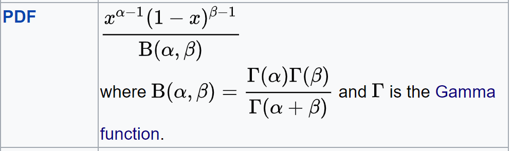
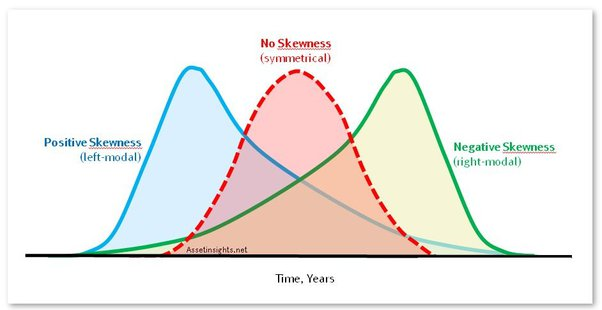
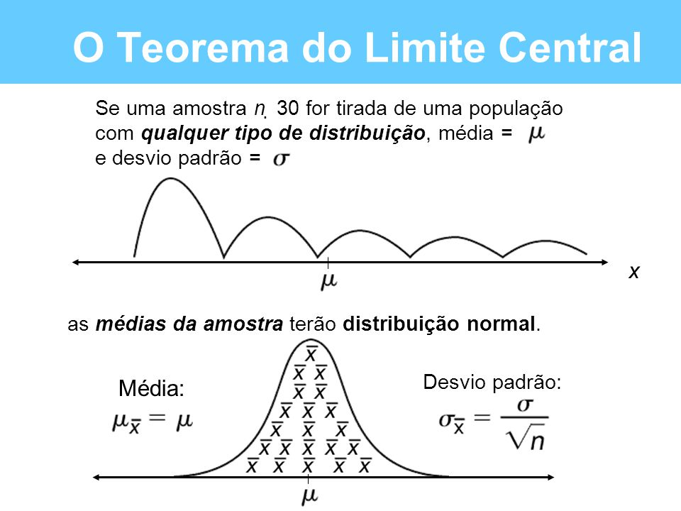

    Como já vimos, na Inferência Estatística, partimos do particular para o geral. Na prática, vamos usar nossa amostra para fazer estimativas que servirão para compreender a nossa população.

    Para que possamos fazer boas estimativas sobre nossos dados, primeiro precisamos entender como eles se comportam. Nesse sentido, a Estatística Descritiva tem um papel essencial.

=> BERNOULLI

    Essa é uma distribuicão para dados discretos, quando os dados assumem valor 1 ou 0.

  

  A distribuição de probabilidade de uma Bernoulli fica assim:

 

    Na prática, admite-se somente dois tipos de resultados, o sucesso ou fracasso.
    O sucesso é o que se deseja observar, por exemplo, se o seu interesse for observar a ocorrência de defeito em peças. Uma peça selecionada aleatoriamente, com defeito, seria um resultado do tipo “sucesso” (o resultado “sucesso” não está associado a algo bom, necessariamente).
    Considere um problema (experimento) no qual só podem ocorrer dois tipos de resultados, “sucesso” e “fracasso”.

=> BINOMIAL

    Essa é uma distribuicão para dados discretos, quando os dados que temos se resume ao número de sucessos numa sequência de n tentativas, onde cada tentativa tem somente dois resultados possíveis: sucesso e fracasso. Por exemplo, a quantidade de caras em um 10 lançamentos de uma moeda, ou o número de usuários que vão cancelar um serviços de streaming dentro de toda a base de assinantes.

     distribuição de probabilidade de uma Binomial fica assim:

=> POISSON

    Essa é uma distribuicão para dados discretos, indicada para usar quando os dados que temos são de contagem. Por exemplo, a quantidade de pessoas numa fila, a quantidade de acidentes em um ano ou a quantidade de cliques em um botão num site.

    A distribuição de probabilidade de uma Poisson fica assim:

=> EXPONENCIAL

    Essa é uma distribuicão para dados contínuos, muito utilizada para medir tempo de esperada ou tempo de gasto em alguma atividade. Por exemplo, enquanto a Poisson seria utilizada para contar a quantidade de pessoas numa fila, a Exponencial seria utilizada para o tempo de espera nessa fila. No mercado, é bastante utilizada para medir o tempo que os usuários permanecem no app ou no site. Em geral, é útil quando muitas pessoas passam pouco tempo em uma atividade, enquanto poucas pessoas passam muito tempo.

    A distribuição de probabilidade de uma Exponencial fica assim:

=>BETA

    Essa é uma distribuicão para dados contínuos, muito utilizada para modelar probabilidades, pois os dados devem estar entre o intervalo de 0 e 1. Por exemplo, imagine que cada usuário tenha uma probabilidade de acesso ao app, ou de churn, ou de comprar um produto numa e-commerce. Todos esses casos seriam aplicações possíveis para a distribuição Beta.

    A distribuição de probabilidade de uma Beta fica assim:

=> DISTRIBUIÇÃO NORMAL

    A distribuição Normal é uma distribuição para dados contínuos, muito utilizada em diversas aplicações da Estatística. Seu nome oficial é Gaussiana mas, por representar tantos dados que encontramos no dia a dia, acabamos por chamá-la de normal.

    Essa é uma distribuição que tem um comportamento simétrico em torno da média, onde os valores próximos da média são muito frequentes e os distantes da média, poucos frequentes.

    Dados como de altura, peso, performance no trabalho, notas acadêmicas, todos tendem a se comportar como uma distribuição normal, onde temos muitas ocorrências parecidas com a média, poucas ocorrências de valores muito altos e poucas ocorrências de valores muito baixos.

    E como fica a distribuição de probabilidade de uma Normal?

    Quando dizemos que a distribuição Normal é simétrica, quer dizer que o ponto referente ao pico da curva separa a área abaixo da curva em duas partes exatamente iguais!

    Numa definição mais formal, numa distribuição simétrica, a moda, média e mediana são iguais

    A distribuição Normal mais importante é a Normal Padrão, que tem média = 0 e desvio padrão = 1

=>T DE STUDENT

    Essa é uma distribuicão para dados contínuos, muito parecida com a distribuição Normal. A distribuicão inteira depende de somente um parâmetro v, a quem chamamos de grau de liberdade. Quanto maior o grau de liberdade, mais a T de Student se aproxima de uma distribuição Normal.
    Para graus de liberdade pequenos, as caudas possuem mais probabilidade do que a distribuição Normal e, por isso, é muito utilizada em dados amostrais, quando não sabemos a variância da população e a estimamos utilizando a variância amostral.

    A distribuição de probabilidade de uma T de Student fica assim:

=>TEOREMA DI LIMITE CENTRAL

    Esse teorema afirma que quando o tamanho da amostra aumenta, a distribuição amostral da sua média aproxima-se cada vez mais de uma distribuição normal.

  

    É isso mesmo que você ouviu! A média amostral vai ter uma distribuição normal e a partir disso, temos muitas aplicações: Testes de Hipótese, Intervalos de Confiança, Regressões Lineares, etc.